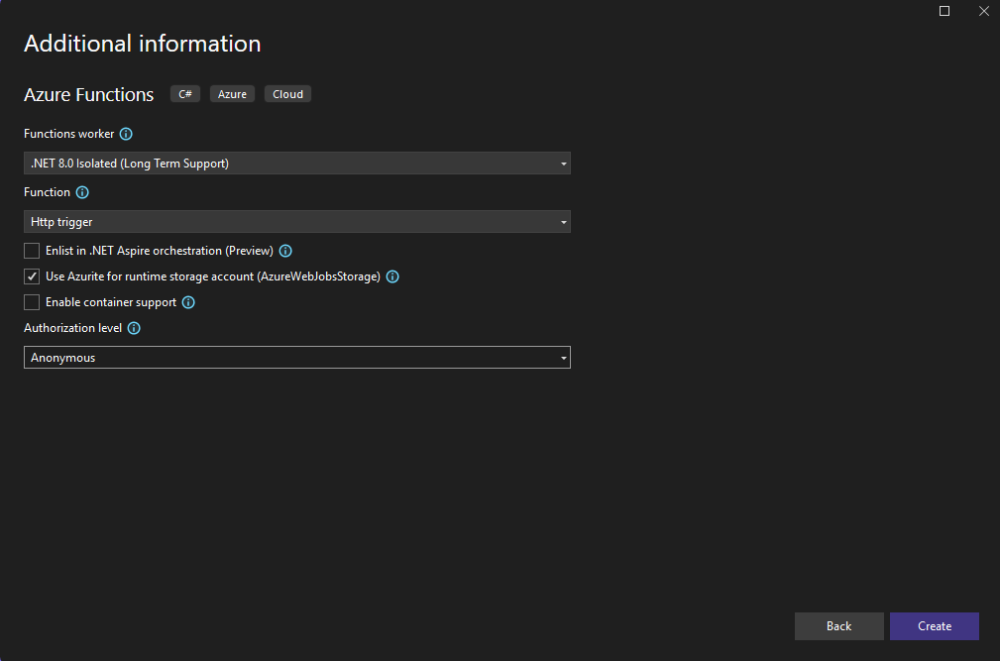
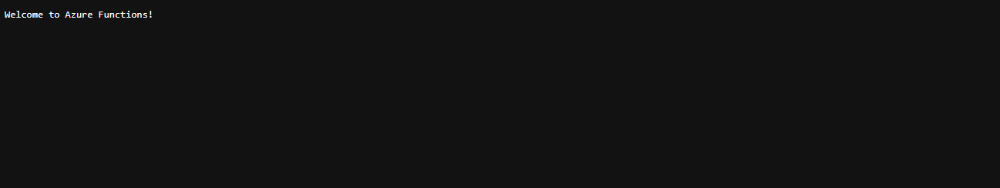
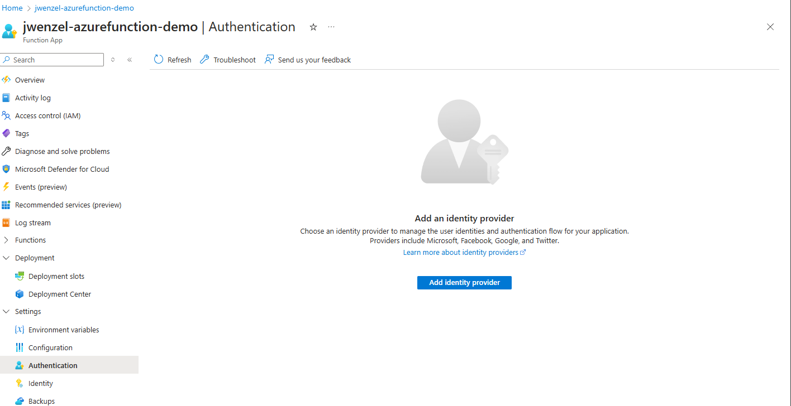
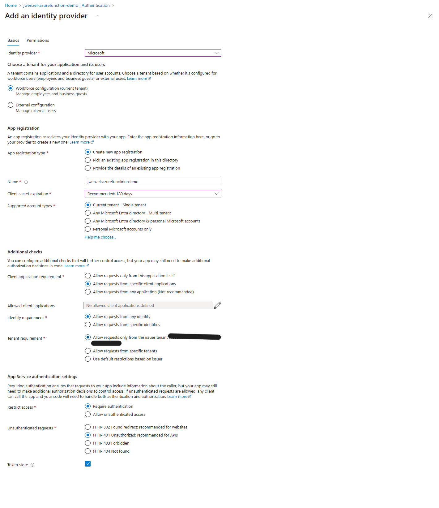
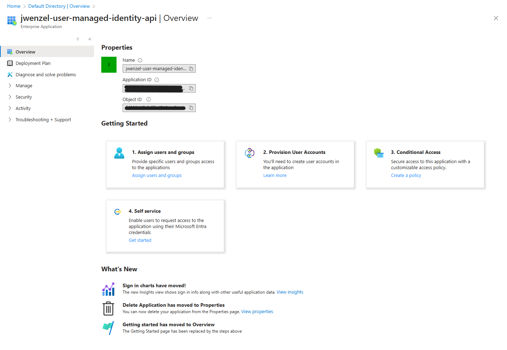
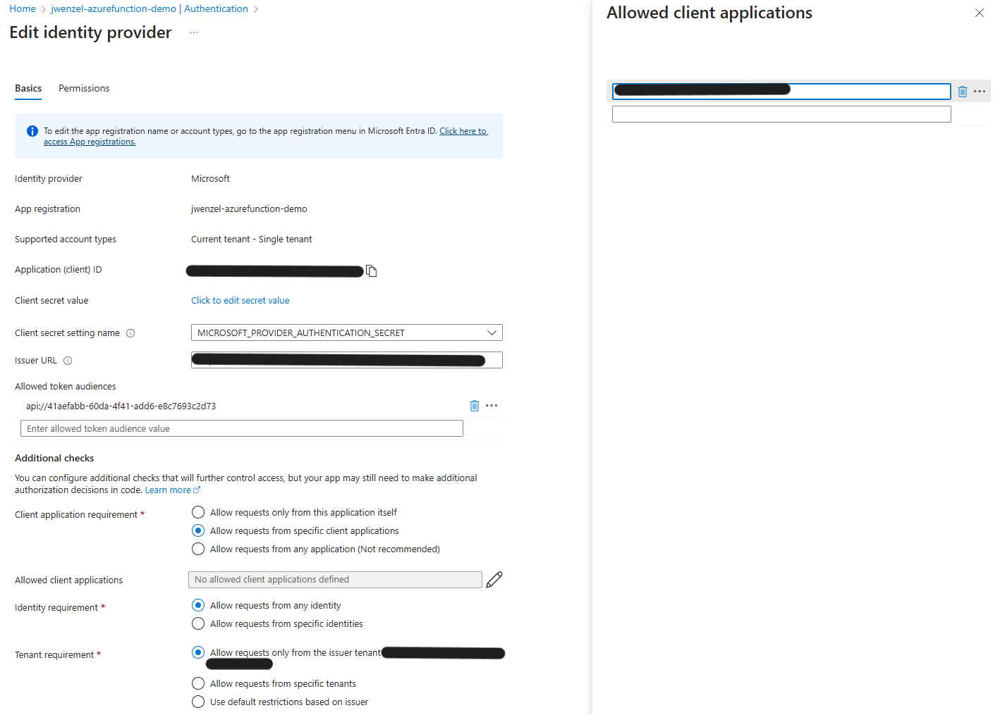

One problem I ran into at my job was to create an Azure App Service that could authenticate with an Azure Function.

A possible solution for the problem is to use an App Registration. With the app registration set up for both the Function and App Service, you can authenticate between the two of them. The flow goes like:

* Set up app registrations for both applications
* On the app registration for the app service, you need to create a secret in order to authenticate as that application
* With the secret and the client id of the azure function app registration, you can now create an auth token
* Set the auth token in the Bearer token of the request

While this solves the problem, it leaves room for a security vulnerability or potential down time of the application.

* The secret must be renewed every so often. Failing to renew the secret can cause potential downtime.
* The secret must be stored somewhere, like KeyVault. Obviously, you don't want it in plaintext in some code, which can happen by accident.
* If an attacker had the client id and the secret, they can easily impersonate.

This becomes very unwieldy, especially for a large application. I haven't found a way where you can easily rotate these secrets, and perhaps that was be design.

### Using Managed Identities

Managed Identities are used pretty commonly throughout Azure. In simple terms, managed identities gives the application a sort of context to run as. For example, you can have a managed identity set on a application so that the identity can access things like KeyVault or Storage accounts. That identity can also be given specific roles to access resources.

Unfortunately, there isn't much documentation on how to use them to make authenticated HTTP requests. But after some digging and trial and error, I managed to figure how to do it! The rest of this post will show you how to do it via a tutorial-style explanation.

### Prerequisites

You will need the following before starting.

* Azure Account and Subscription
* Visual Studio 2022

### Setting up Azure Function Code

First create a new Visual Studio solution. After creating, create a new project called "Azure Function". Name it whatever you want, just make sure to set it as "Http Trigger" and set Authorization Level to "Anonymous". By default, it will create an Azure Function called `Function1` which you will use for calling.



And that's all you need to do for the Azure Function!

### Setting up Azure App Service Code

In the same solution, create another project from "ASP.NET Core Web API". This will be the Web API that we need to authenticate so that it can make secure requests. The default values should be adequate for the application.

Once you set up the new project, you will need to create add some nuget packages:

* Azure.Identity
* Microsoft.Extensions.Azure

These packages are what are going to be used to help us authenticate with Azure later.

Now, create a new class called `AzureFunctions`. This class will be used by the Controller, which we will create later, to make requests to the Azure Functions. Then fill in the class with the following:

```cs
public class AzureFunctions
{
    private string BaseUrl { get; }
    private HttpClient HttpClient { get; }

    public AzureFunctions(string baseUrl)
    {
        BaseUrl = baseUrl;
        HttpClient = new HttpClient();
    }

    public string GetAzureFunction()
    {
        string url = $"{BaseUrl}/api/Function1";
        var response = HttpClient.GetAsync(url).Result;
        if (response.IsSuccessStatusCode)
        {
            return response.Content.ReadAsStringAsync().Result;
        }
        else if (response.StatusCode == System.Net.HttpStatusCode.Unauthorized)
        {
            return "Unauthorized to access azure function application";
        }
        else
        {
            return $"Unexpected error code {response.StatusCode}";
        }
    }
}
```

`baseUrl` will be the domain name of the Azure Functions. When running locally it will be `localhost` with some port number: `http://localhost:7071` for example. Note that we don't have any authentication. For the moment, this is ok and we will update later to have the correct authentication.

In the Program.cs of the web API, add the following before builder.Build() call.

```cs
var baseUrl = builder.Environment.IsDevelopment()
    ? "http://localhost:<port_number>"
    : ""; // This will be updated later with the name of the production application
builder.Services.AddSingleton(new AzureFunctions(baseUrl));

var app = builder.Build();
```

This allows us to create a singleton that can be passed to controllers. This may be a little overkill for a tutorial, but it simplifies setting up the necessary URL for localhost and production. For `<port_number>`, you can find that in the `commandLineArgs` variable in Azure Function > Properties > launchSettings.json
Now, time to create the controller. Create a new C# class called `HelloWorldController` and copy the following:

```cs
using Azure.Identity;
using AzureServiceAPI.Utils;
using Microsoft.AspNetCore.Mvc;
using System.Threading;
using System.Net.Http.Headers;

namespace AzureServiceAPI.Controllers
{
    [ApiController]
    [Route("/api/[controller]")]
    public class HelloWorldController : Controller
    {
        private AzureFunctions functions;

        public HelloWorldController(AzureFunctions functions) 
        {
            this.functions = functions;
        }

        public IActionResult Index()
        {
            try
            {
                return new OkObjectResult(functions.GetAzureFunction());
            }
            catch (Exception ex)
            {
                var result = new OkObjectResult(ex.ToString());
                return result;
            }
        }
    }
}
```

We are using dependency injection to pass the azure function class that we created in the Program.cs file at application startup.

### Testing the applications together

To test the applications running together, you need to run them simultaneously. A way to do this in Visual Studio is to right-click on the solution in the Solution Explorer and select "Configure Startup Projects...". Then under Common Properties > Configure Startup Projects, select "Multiple startup projects". For both applications, select "Start" as the action. This will launch both applications when you run "Start".

When you run start, you have 2 URLs you can go to:

* Azure App Service: `http://localhost:<azure_app_service_port_number>/api/HelloWorld`
* Azure Function: `http://localhost:<azure_function_port_number>/api/Function1`

To ensure, the Azure Function is working correctly, go to azure function url. You should see the following:



Once you confirm that is working correctly, go to the Azure App Service url and you should see the same result.

### Deploy Azure Function

Now that we have know the functions are working locally, we are ready to try in Azure. You can deploy the Azure Function application with Visual Studio. I'll assume that the reader knows a bit about Azure and Azure Functions so simply deploy the Azure Function to a new or existing Azure Function in your subscription. After the application has been deployed, make sure to grab the url which will be used in the next section.

It might be a good idea to verify that the Azure Functions are working, so in a browser go to the url of the function: `https://<azure_function_name>.azurewebsites.net/api/Function1`. You should see the welcome message like in the previous section.

### Deploy Azure App Service

Using the url you got in the last section, update the `baseUrl` instantiation to be the following:

```cs
var baseUrl = builder.Environment.IsDevelopment()
    ? "http://localhost:<port_number>"
    : "https://<azure_function_name>.azurewebsites.net"; // Update <azure_function_name> with the name of your application
```

Now, deploy the application to an app service instance in your subscription. After successfully deploying, check the application via the URL on the App Service dashboard and then go to it with the URL in a browser: `https://<azure_app_service_name>.azurewebsites.net/api/HelloWorld`. Like before, you should see "Welcome to Azure Functions!" like in the previous sections.

### Configure Azure Function Authentication

Ok, so we are able to call our Azure Function from our Azure App Service! But what if we want only the App Service to call this Azure Function? Right now, anyone can call this azure function, which may not be desirable. So, how do we add authentication?

Go to the Azure Function landing page. Once there go to Settings > Authentication. Your page should look like this:



Click "Add identity provider" and select "Microsoft". Set the settings to the following

* AppRegistrationType: "Create new app registration"
* Name: <what_ever_name_want>
* Client secret Expiration: "180 days"
* Supported account types: "Current tenant - Single tenant"
* Client application requirement: "Allow requests from specific client applications"
* Identity requirement: "Allow request from any identity"
* Tenant requirement: "Allow requests only from the issuer tenant
* Restrict access: "Require authentication"
* Unauthenticated requests: "HTTP 401"



Click save and try to call the app service application from your browser again. You should get "Unauthorized to access azure function application", meaning that the Azure App Service Application is getting a 401. This makes sense, because the azure function is blocking everyone except those "Allowed Client Applications". But because there are no clients specified, every one is blocked.

### System Identity

What can we do now? One easy way to do it is to have another application registration for the app service, and then manually generate a secret for app registration that you created for the azure function.

However, this isn't super secure. As mentioned previously, you have to manually rotate secrets, store them somewhere like Azure KeyVault, and if a secret gets compromised, you have to manually change the secrets and restart the application and delete the old secret. This recipe for disaster and downtime.

The cleaner solution is to use some kind of Identity. For this demo, I will use System Managed Identity, but perhaps in another article I will show how to use a User Managed. The main reason for using a System Managed Identity is that setup is basically just a few button clicks.

Seriously. Go to the Azure App Service Application landing page > Settings > Identity. Under "System Assigned" change "Status" to "On" and save. Restart the application and now the system identity is set up.

But this still hasn't fixed the problem. There is no clear way to "assign" app service to the azure function, much like you can do with role based access control. So how do grant the app service permission to access the Azure Function?

The solution is the Enterprise Application Id.

### Enterprise Application Id

Apparently, when a System Managed Identity is created, it creates an Enterprise Application Id, something that isn't clear in the documentation. Go to "Enterprise Applications" and under "All applications" look for the name of the app service application, and select to open it up. It should look like the following:



Now all you need to do is collect the "Application ID". This is the client ID that you can use in the allowed client applications in the azure function.

Go back to the Azure Function authentication landing and edit the Microsoft Identity Provider. Under "Allowed client applications" set the GUID that you got from the Enterprise Application ID.



### Authenticating with code

Now with if you try to run the application, you're still going to get an authentication error. This is because the code still isn't doing anything to authenticate in the HTTP request. So, in this section I am going to show how to set up the HTTP request in the azure app service to authenticate with the azure functions.

Create a new class called `ActiveDirectoryAuthTokenGenerator`. This class will contact Azure to get the appropriate token for a specific resource. By using `DefaultAzureCredential`, it will use the credentials of the identity currently running. In Azure, this can be the System Managed Identity or the User Managed Identity, depending on what you used. If you are running on your local machine, this could be your credentials.

Fill the class in with this code:

```cs
public class ActiveDirectoryAuthTokenGenerator
{
    private readonly Guid ResourceId;

    public ActiveDirectoryAuthTokenGenerator(Guid resourceId)
    {
        this.ResourceId = resourceId;
    }

    public string GetAuthHeader()
    {
        // Create a new DefaultAzureCredential instance, which will automatically use Managed Identity when available.
        var credential = new DefaultAzureCredential();

        string[] scopes = new string[] { $"{ResourceId}/.default" };
        var authResult = credential.GetToken(new TokenRequestContext(scopes));
        var authHeader = $"Bearer {authResult.Token}";

        return authHeader;
    }
}
```

This basically get a auth token that will be used to authenticate with identity provider, functionality provided by Azure. Now, we need to set up the `AzureFunctions` code get the token and set it in auth headers. Update the `AzureFunctions` code to the following:

```cs
public class AzureFunctions
{
    private string BaseUrl { get; }
    private HttpClient HttpClient { get; }
    private ActiveDirectoryAuthTokenGenerator AuthenticationToken { get; }

    public AzureFunctions(string baseUrl, ActiveDirectoryAuthTokenGenerator authenticationToken)
    {
        BaseUrl = baseUrl;
        HttpClient = new HttpClient();
        AuthenticationToken = authenticationToken;
    }

    public string GetAzureFunction()
    {
        HttpClient.DefaultRequestHeaders.Authorization = AuthenticationHeaderValue.Parse(AuthenticationToken.GetAuthHeader());
        string url = $"{BaseUrl}/api/Function1";
        var response = HttpClient.GetAsync(url).Result;
        if (response.IsSuccessStatusCode)
        {
            return response.Content.ReadAsStringAsync().Result;
        }
        else if (response.StatusCode == System.Net.HttpStatusCode.Unauthorized)
        {
            return "Unauthorized to access azure function application";
        }
        else
        {
            return $"Unexpected error code {response.StatusCode}";
        }
    }
}
```

Here, we take in an `ActiveDirectoryAuthTokenGenerator` object and saving in a local variable. Then when `GetAzureFunction` is called, we get the auth token and set it in the `Authorization` header.

### Success!

Publish the Azure App Service code to the cloud and go to the Azure App Service URL. You should see the following:


And that's it! We have secure HTTP requests from the Azure App Service to the Azure Functions! Of course, there are other things that you can do to increase the security, like making the Azure Function and Azure App Service exist on the same Virtual Network (VNET), but it isn't absolutely necessary for simple things.

Let me know if you run into any issues, and I'll be happy to help where I can!
